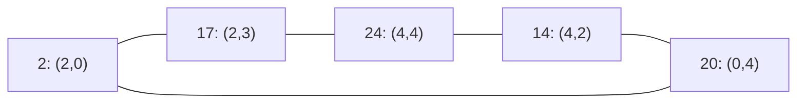

# B047反証：頂点推移的な二点制約P局面でも固定ペアはない

原文の条件をすべて満たす5×5の局面を構成した。R(S)は正確にC₅で、
g(S)=0だが固定ペア応答は不可能。非幾何的なグラフ対称性も原文の頂点推移性に含む。

## 局面と全残余ゲーム

S={(0,0),(1,0),(1,1),(3,2),(0,3),(3,4)}、mask=8,429,635。
合法点は正確に

L={(2,0),(4,2),(2,3),(0,4),(4,4)}、id=[2,14,17,20,24]。

包含極小な残余禁止集合は次の五辺だけで、すべて二点制約である。

この五点の全32部分集合を検査し、安全な継続がC₅の独立集合と正確に一致することを
確認した。安全継続は11個、終局は非隣接二点を追加した五局面、総石数8。
三点・四点の追加制約もこの五辺のどれかを含み、新たな極小制約にはならない。

## 原文の条件と結論

五つの巡回回転が辺集合を保ち、任意の合法頂点を任意の他頂点へ送れる。
従ってP(S)=C₅は頂点推移的。

どの最初の合法点を選んでも、残る二合法点は一辺で結ばれる。
その子のgは1、従って元のgはmex{1}=0。すべての対局は二手で終わり、後手が勝つ。

一方、固定ペア応答を与える対合fは、各合法点pに対して別の合法点f(p)を与える必要がある。
同じ点への応答は再着手になり、現在違法な点は石を追加しても合法へ戻らない。
従ってfはL上の固定点を持たない対合でなければならない。
そのような対合の台集合は二点組へ分割されるため偶数個だが、|L|=5。
よって固定ペア応答は存在せず、**B047の原命題はREFUTED**。

後手の通常戦略は存在する。相手が選んだ頂点から距離2の二点のどちらかを選べば終局する。
この動的な選択と、全点をあらかじめ対へ割り当てる固定応答は異なる。

## 検算

全曲線の占有数、禁止四点組の包含、各継続の全四点の直接整数行列式の三判定が一致。
全巡回自己同型と全継続mexも照合した。盤サイズ・占有石数の最小性は主張しない。

[全32継続・五辺の四点証人・巡回置換・ソースSHA256](round31_b047_odd_cycle.json)、
[再現スクリプト](scripts/round31_b047_odd_cycle.py)。
